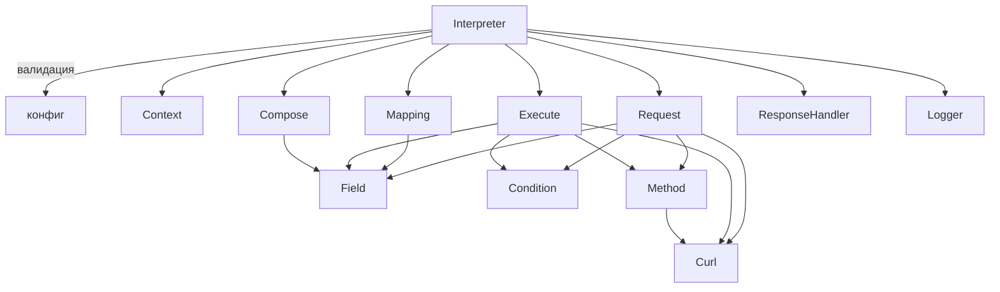

# Архитектура: компоненты и связи

Интерпретатор — это оркестратор (`Interpreter`) плюс набор
независимых компонентов: резолверы разрешают выражения,
экзекуторы выполняют блоки, `Context` хранит состояние.

---

## Компоненты

| Компонент                          | Роль                                                                                                          |
| ---------------------------------- | ------------------------------------------------------------------------------------------------------------- |
| `Interpreter`                      | Оркестратор: валидация конфига, запуск блоков по `action_logic`, итерации, транзакции, логирование результата |
| `Context`                          | Состояние запуска: данные, `params`, ошибки, снимки итераций, `response`; лог-фасад                           |
| `Field` (Resolver)                 | Разрешает выражения-значения: `field:`, цепочки, `{{ }}`, литералы                                            |
| `Condition` (Resolver)             | Разрешает условия: равенства, `!`, `func:*`, `method:*`, AND/OR                                               |
| `Method` (Resolver)                | Вызывает функции/методы: `params`, `element`, `on_error`, `change_values`, `mapping`-плейсхолдер              |
| `Request` (Executor)               | Блок `request`: main, static, extra, query, curl, `request_logic`, итерации                                   |
| `Mapping` (Executor)               | Блок `mapping`: одиночный и списочные маппинги                                                                |
| `Execute` (Executor)               | Блок `execute`: if/elseif/else, действия, skip, response                                                      |
| `Curl` (Executor)                  | HTTP-запросы (используется `Request` и `Execute`) через `ICurlLogic`                                          |
| `Compose` (Executor)               | Блок `compose`: финальная сборка ответа                                                                       |
| `Config` / `Execution` (Exception) | Ошибки конфига (с путём) / ошибки выполнения                                                                  |
| `ResponseHandler`                  | Единая форма ответа `{status, data, global}`                                                                  |
| `Logger`                           | Продакшен-логирование (внедряется через `setLogger`)                                                          |

---

## Схема взаимодействия



Все компоненты получают `Context` в конструкторе и пишут
в него результаты — друг о друге напрямую не знают.

---

## Цикл выполнения

```text
Interpreter::run(action, endpoint, inputData, params)
 ├─ валидация конфига            → ConfigException с путём
 ├─ Context: данные + params
 ├─ для каждого шага action_logic:
 │    Request  (static → extra → query → curl или request_logic)
 │    Mapping
 │    Execute  (if/elseif/else, итерации обрабатывает Interpreter)
 │    Compose
 ├─ итерации: resetForIteration, снимки, recordIterationError
 ├─ транзакции: partial / all_or_nothing
 └─ ResponseHandler + logResult (если logging ≠ false)
```

---

## Внедрение зависимостей

| Зависимость                           | Как подменяется                                                                                                       |
| ------------------------------------- | --------------------------------------------------------------------------------------------------------------------- |
| `Logger`                              | `setLogger(new Logger([...]))`; без логгера интерпретатор работает (null-safe)                                        |
| `ICurlLogic`                          | конструктор `Curl`-экзекутора принимает реализацию; в тестах — `MockCurlLogic` с очередью ответов                     |
| `ResponseHandler` / `Logger` (классы) | в продакшене — корпоративные, в standalone — минимальные из репозитория; имена совпадают, подмена через автозагрузчик |

Благодаря `ICurlLogic` все 130+ тестов работают без сети:
мок возвращает заготовленные ответы по очереди.

---

## Два окружения

|                 | Standalone (ПК/CI) | Bitrix (сервер)                        |
| --------------- | ------------------ | -------------------------------------- |
| autoload        | `src/autoload.php` | корпоративный                          |
| Logger          | минимальный (файл) | корпоративный (UF_REQUEST)             |
| ResponseHandler | минимальный        | корпоративный                          |
| логи тестов     | `tests/logs/`      | `/local/local_logs/interpreter_tests/` |

Код интерпретатора **одинаковый** в обоих окружениях —
различаются только внешние сервисы.

---

## Куда дальше

- [Контекст и params](context.md) — где живут данные
- [Логирование](logging.md) — формат лога и флаги
