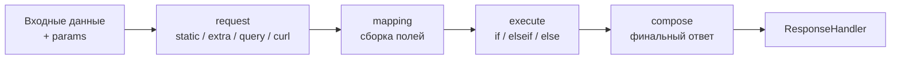

# Блоки конфигурации: обзор

Каждый эндпоинт собирается из четырёх блоков. Блок отвечает
на свой вопрос; `action_logic` задаёт порядок их выполнения.

| Блок      | Вопрос                                      | Подробнее             |
| --------- | ------------------------------------------- | --------------------- |
| `request` | Откуда данные и что вычислить?              | [request](request.md) |
| `mapping` | Какие поля сущности собрать?                | [mapping](mapping.md) |
| `execute` | Какие решения принять и действия выполнить? | [execute](execute.md) |
| `compose` | Что вернуть клиенту?                        | [compose](compose.md) |

---

## Поток данных

Каждый следующий блок видит в контексте результаты предыдущих.
Внутри `request` порядок шагов задаёт `request_logic`
(по умолчанию `static → extra → query → curl`).

---

## request — данные и вычисления

- `main` — источник входных данных (`post` / `get` / `request`);
- `static` — справочники: сырые массивы и `Class::method`;
- `extra` — вычисляемые поля (методы, функции, шаблоны, условия);
- `query` — вызовы методов классов (БД, CRM) с `conditions` и `on_error`;
- `curl` — HTTP-запросы к внешним API;
- `array` — итерационный режим (цикл по массиву);
- `request_logic` — произвольный порядок шагов.

## mapping — сборка сущности

- одиночный режим: плоские и вложенные поля (`FM.PHONE.n0.VALUE`);
- именованные списочные маппинги (`source` + `mapping`) — трансформация
  каждой строки списка;
- `source` без `mapping` — сырой список под своим именем.

## execute — решения и действия

- цепочка `if / elseif / else` — срабатывает первый истинный блок;
- условия: `filter` (выражения) или `method`/`class`/`params` (вызов);
- действия: вызовы методов, `skip`, curl-действия, `response`;
- `response`-only действия — запись в ответ без вызова метода;
- `change_values` — трансформация результата запроса.

## compose — финальная сборка

- собирает ответ любой вложенности из контекста;
- корневое выражение `'compose' => 'field:x'` — вернуть объект как есть,
  без обёртки.

---

## Общие механизмы всех блоков

| Механизм                          | Где работает                          |
| --------------------------------- | ------------------------------------- |
| `conditions`                      | query, curl, extra, отдельные actions |
| `on_error`                        | query, curl, методы                   |
| `field:` / `{{ }}` / цепочки `\|` | любые значения во всех блоках         |
| `params.x`                        | везде, включая url и headers curl     |
| `result` / `result:key`           | response после вызова метода          |

---

## Куда дальше

- [request](request.md) — самый насыщенный блок
- [mapping](mapping.md)
- [execute](execute.md)
- [compose](compose.md)
- [Контекст и params](../components/context.md) — где живут данные между блоками
